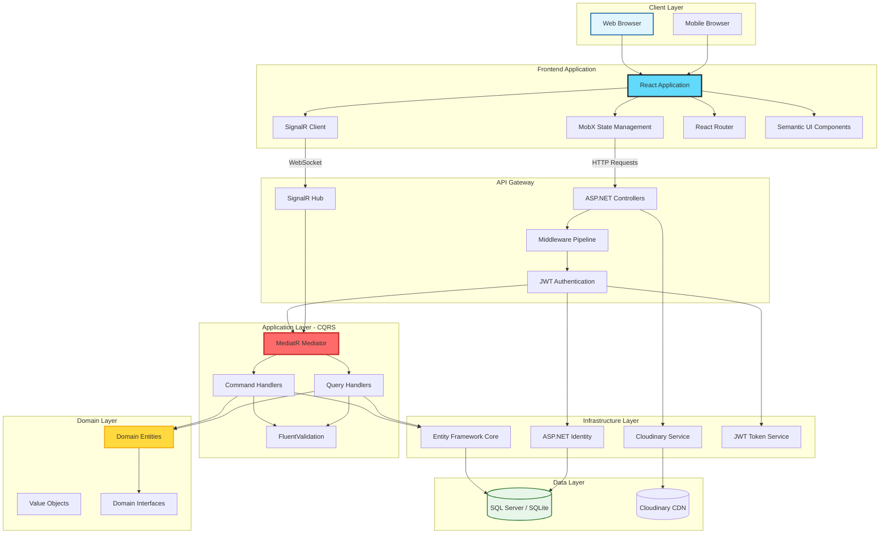
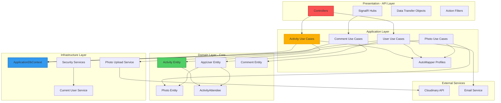
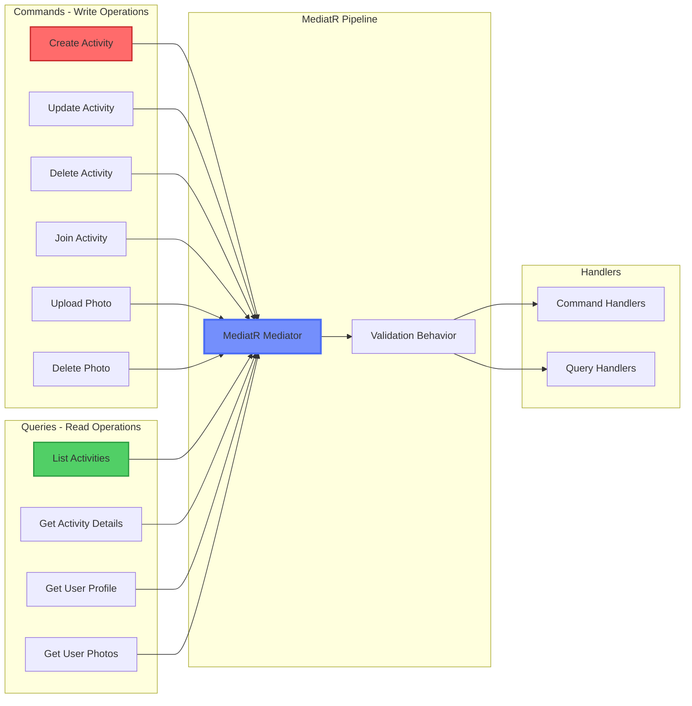
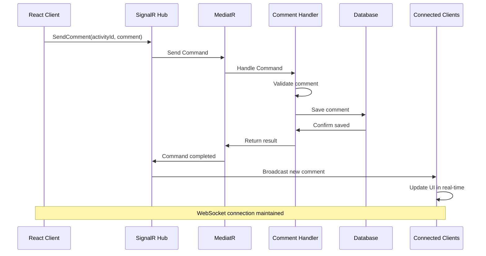
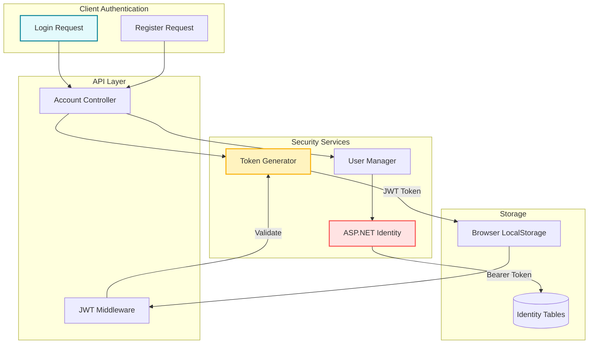
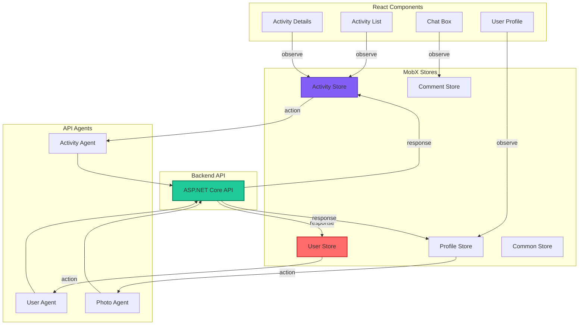
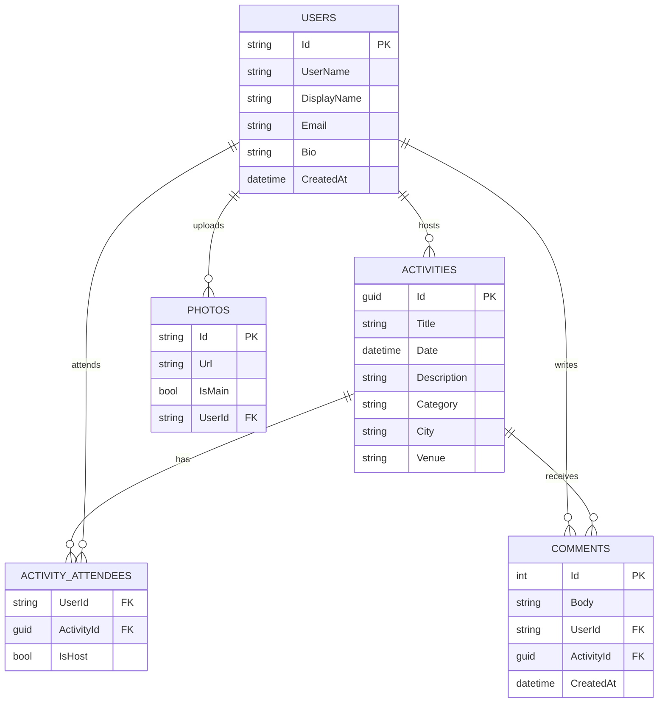

# Lively - System Architecture

## Overview
Lively is a social networking platform built with Clean Architecture principles, featuring real-time chat, activity management, and photo uploads. Demonstrates CQRS pattern with MediatR and ASP.NET Core 3.1.

## High-Level Architecture

## Clean Architecture Layers

## CQRS Pattern Implementation

## Real-Time Communication Flow

## Authentication & Authorization Flow

## Photo Upload Architecture

```mermaid
graph LR
    subgraph "Client Side"
        FileInput[File Input]
        ImageCrop[Image Cropper]
        Preview[Image Preview]
    end

    subgraph "API Layer"
        PhotoController[Photo Controller]
        PhotoCommand[Add Photo Command]
    end

    subgraph "Application Layer"
        PhotoHandler[Photo Handler]
        Validator[Photo Validator]
    end

    subgraph "Infrastructure"
        PhotoAccessor[Photo Accessor Service]
        CloudinarySDK[Cloudinary SDK]
    end

    subgraph "External"
        CloudinaryCDN[(Cloudinary CDN)]
    end

    subgraph "Database"
        PhotoEntity[(Photo Records)]
    end

    FileInput --> ImageCrop
    ImageCrop --> Preview
    Preview --> PhotoController

    PhotoController --> PhotoCommand
    PhotoCommand --> PhotoHandler
    PhotoHandler --> Validator
    Validator --> PhotoAccessor

    PhotoAccessor --> CloudinarySDK
    CloudinarySDK --> CloudinaryCDN

    CloudinaryCDN -->|Photo URL| PhotoEntity
    PhotoEntity --> PhotoHandler

    style FileInput fill:#d3f9d8,stroke:#37b24d,stroke-width:2px
    style CloudinarySDK fill:#748ffc,stroke:#4c6ef5,stroke-width:2px
    style CloudinaryCDN fill:#ffd43b,stroke:#fab005,stroke-width:2px
```

## State Management with MobX

## Database Schema

## Technology Stack

### Backend
- **ASP.NET Core 3.1**: Web API framework
- **Entity Framework Core**: ORM for data access
- **MediatR**: CQRS pattern implementation
- **AutoMapper**: Object-to-object mapping
- **FluentValidation**: Input validation
- **ASP.NET Identity**: User authentication
- **SignalR**: Real-time communication
- **JWT**: Token-based authentication

### Frontend
- **React 16**: UI library
- **MobX**: State management
- **Semantic UI React**: Component library
- **React Router DOM**: Client-side routing
- **Axios**: HTTP client
- **SignalR Client**: WebSocket client
- **Formik**: Form management
- **Yup**: Schema validation

### Infrastructure
- **SQL Server / SQLite**: Relational database
- **Cloudinary**: Photo storage and CDN
- **JWT Bearer**: API authentication

## Key Design Patterns

1. **Clean Architecture**: Separation of concerns across layers
2. **CQRS**: Command Query Responsibility Segregation
3. **Mediator Pattern**: Decoupled request handling
4. **Repository Pattern**: Data access abstraction
5. **Dependency Injection**: Loose coupling
6. **Observer Pattern**: MobX reactive state
7. **Factory Pattern**: SignalR connection creation

## Performance Optimizations

### Backend
- EF Core query optimization with projections
- Lazy loading disabled for performance
- AutoMapper query extensions
- Response caching for read operations
- Database indexing on foreign keys

### Frontend
- MobX computed values for derived state
- React.memo for component memoization
- Code splitting with React.lazy
- Virtual scrolling for large lists
- Debounced search inputs
- Optimistic UI updates

## Security Measures

- JWT token authentication
- HTTPS-only communication
- CORS policy configuration
- SQL injection prevention via EF Core
- XSS protection in React
- File upload validation
- Rate limiting on API endpoints
- Password hashing with Identity
